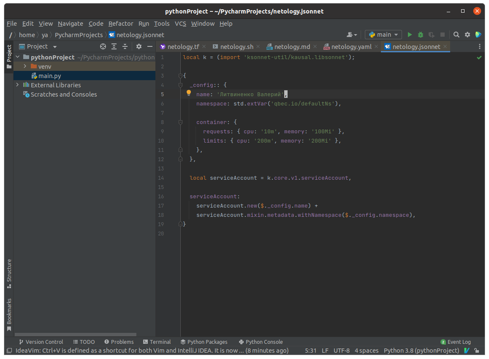
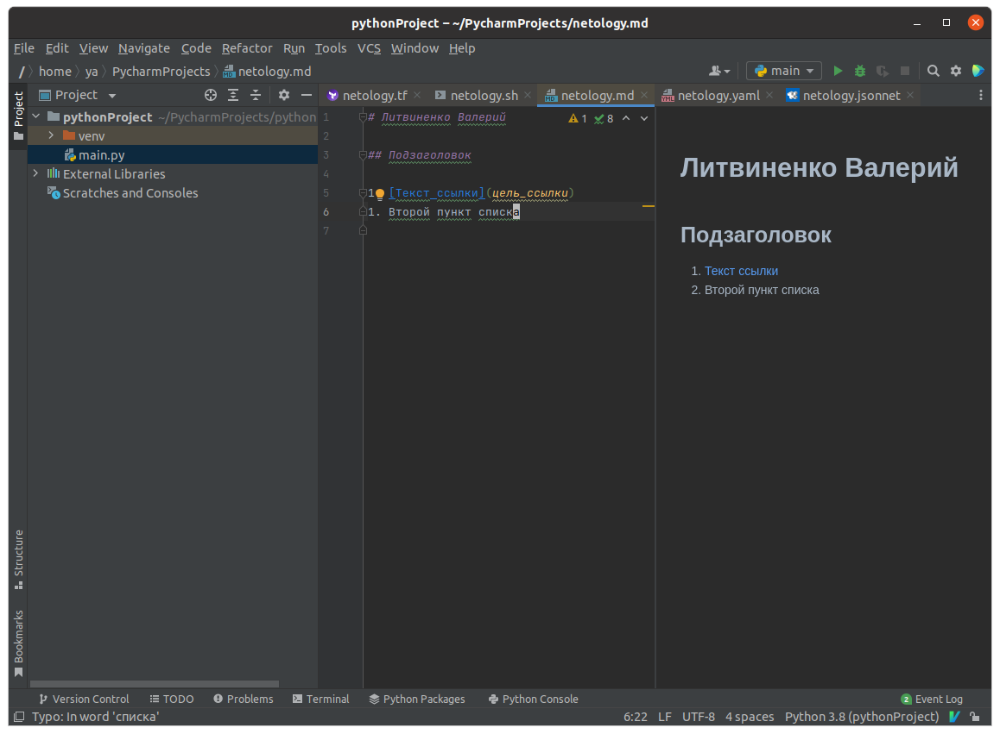
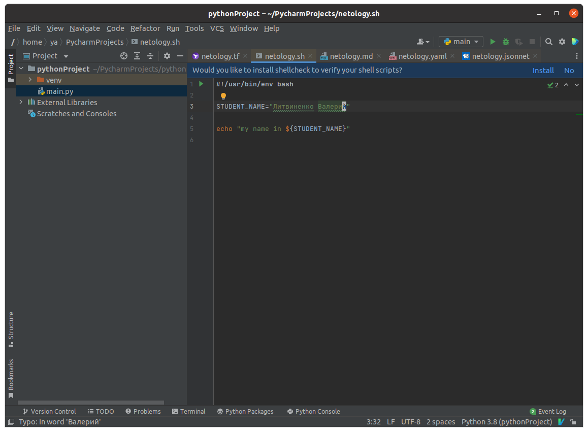
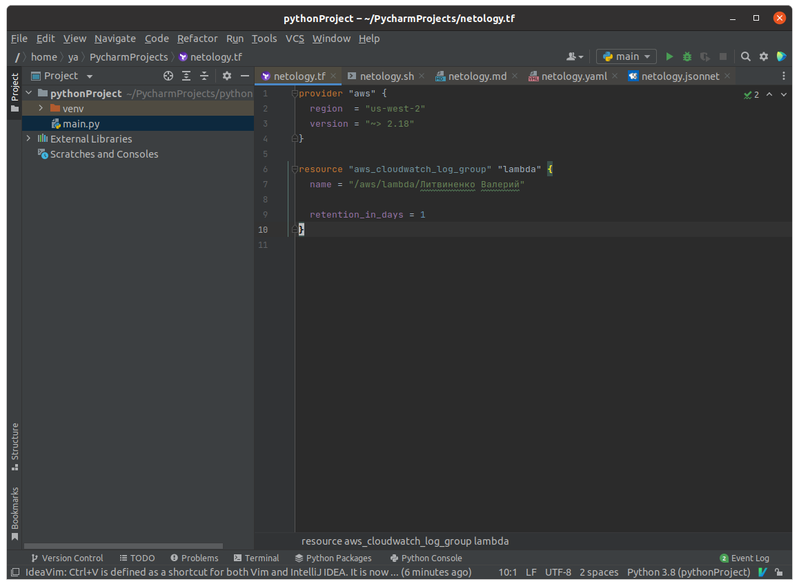
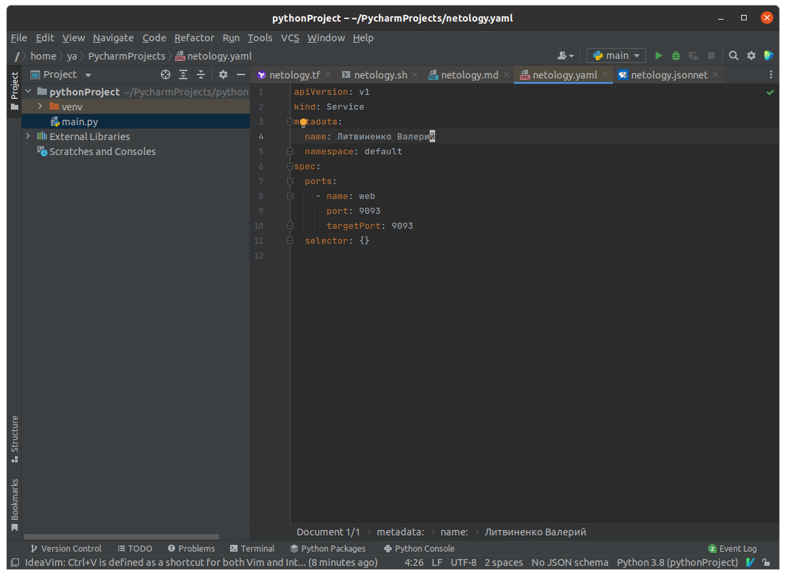

 # 1.1. Введение в DevOps — Литвиненко Валерий
 ## Задание №1 - Подготовка рабочей среды

A dropdown list for markdown

1. Jsonnet:  
1. Markdown: 
1. Shell:
1. Terraform: 
1. Yaml: 

## Задание №2 - Описание жизненного цикла задачи (разработки нового функционала) 
Процесс разработки я бы выстроил следующим образом:
1. Если существует обратная связь через саппорт для клиентов, в первую очередь она попадает на первую линию,которая решает, что нужно для ее выполнения.
2. Если для задачи требуется большая разработка, то требуется собрать совещание с ответственным кругом лиц: разработчики по данному направлению, их лид, чтобы обсудить все аспекты реализации. Сколько человек потребудется? Какой срок? Какие ресуры для введения в продакшн? и т.д.
3. Определили ресурсы необходимые для реализации и дедлайны для каждого этапа. (построили дорожную карту).
4. Контроль на каждом этапе для успешного преодоления узких мест.
5. Команда разработки начинает писать доработки.
6. После создания какой-то части или MVP  можно начинать тесты.
7. Ревью кода тестировщиками + Деплой на тестовый стенд.
8. Если требуется подключить специалистов по безопасности, например, для функционала оплаты.
9. После завершения всех работ финальный тест предпродакшана.
10. Резервное копирование.
11. Ввод в эксплуатацию.
